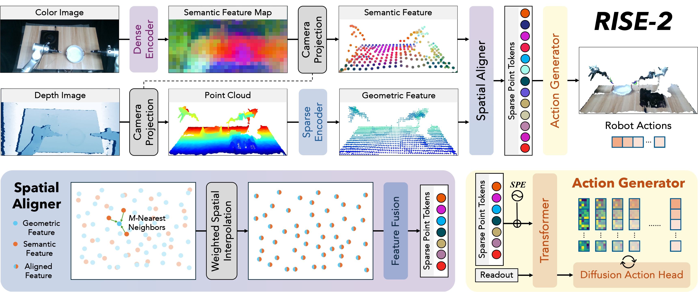

# 📈 RISE-2: A Generalizable Policy for Learning from In-the-Wild Demonstrations

[Paper](https://arxiv.org/abs/2503.03081) | [Project Page](http://airexo.tech/airexo2/) | [***AirExo*-2** Codebase](https://github.com/AirExo/AirExo-2)

**Authors** (for ***RISE*-2**): [Chenxi Wang](https://github.com/chenxi-wang), [Hongjie Fang](https://tonyfang.net/), [Shangning Xia](https://github.com/Xiashangning), [Jingjing Chen](https://github.com/junxix/), [Hao-Shu Fang](https://fang-haoshu.github.io/), [Cewu Lu](https://www.mvig.org/).

This repository contains the full source codes of the ***RISE*-2** policy.



## 🔥 News

- **[Aug 29, 2025]** Fix a bug of SpatialAligner. After the fix, the model shows improved perfomance compared to the version in paper.
- **[May 15, 2025]** Initial release.

## 🛫 Getting Started

### 💻 Installation

Please follow [the installation guide](assets/docs/INSTALL.md) to install the `rise2` conda environments and the dependencies, as well as the real robot environments. 

### 🔨 Configurations

Please follow [the configuration guide](assets/docs/CONFIG.md) to configurate the parameters and environmental constants.

### 📷 Calibration

Please calibrate the camera(s) with the robot before data collection and evaluation to ensure correct spatial transformations between camera(s) and the robot. We use the calibration process in [the ***AirExo*-2** codebase](https://github.com/AirExo/AirExo-2) in this paper. Please refer to [calibration guide](assets/docs/CALIB.md) for more details.

### 🛢️ Data Collection

We use [***AirExo*-2**](http://airexo.tech/airexo2/) to collect both teleoperated and in-the-wild demonstrations. This repository also supports single-arm platform. For more details about data collection, please refer to [the data collection guide](assets/docs/DATA.md).

### 🧑🏻‍💻 Training

Modify the arguments in `command_train.sh`, then

```bash
conda activate rise2
bash command_train.sh 
```

Here are the argument explanations in the training process:

- `--data_path [data_path]`: path to load the data.
- `--ckpt_dir [ckpt_path]`: path to save the checkpoints.
- `--config [config_path]`: path to the configuration files.
- (optional) `--resume_ckpt [ckpt_file]`: path to a checkpoint file to resume training.
- (optional) `--resume_step [step]`: the step number from which to resume training.

### 🤖 Evaluation

Here we provide the sample real-world evaluation code based on the hardwares (Flexiv Rizon 4 robotic arms, Robotiq 2F-85 grippers, Intel RealSense camera). For other hardware settings, please follow [the deployment guide](assets/docs/DEPLOY.md) to modify the evaluation script. We also provide a remote evaluation script for the server-client architecture.

For local evaluation, modify the arguments in [`command_eval_local.sh`](./command_eval_local.sh), then

```bash
conda activate rise2
bash command_eval_local.sh
```

For remote evaluation, modify the arguments in [`command_eval_remote.sh`](./command_eval_remote.sh) and [`command_eval_server.sh`](./command_eval_server.sh), then first execute the server script on the remote server:

```bash
conda activate rise2
bash command_eval_server.sh
```

Then execute the client script on the local machine:

```bash
conda activate rise2
bash command_eval_remote.sh
```

Here are the argument explanations in the deployment process:

- `--type [local/remote]`: local or remote evaluation.
- `--ckpt [ckpt_path]`: path to the checkpoint to be evaluated (required for local evaluation & remote server).
- `--calib [calib_dir]`: the calibration directory.
- `--config [config_path]`: path to the configuration files.
- `--ip [ip]`: the IP address of the remote server (required for both server and client of the remote evaluation).
- `--port [port]`: the port of the remote server (required for both server and client of the remote evaluation).

## 🙏 Acknowledgement

- Our policy codebase is built upon [RISE](https://github.com/rise-policy/rise), with the original CC-BY-NC-SA 4.0 license.
- Our diffusion module is adapted from [Diffusion Policy](https://github.com/real-stanford/diffusion_policy). This part is under MIT License.
- Our transformer module is adapted from [ACT](https://github.com/tonyzhaozh/act), which used [DETR](https://github.com/facebookresearch/detr) in their implementations. The DETR part is under APACHE 2.0 License.
- Our Minkowski ResNet observation encoder is adapted from the [examples](https://github.com/NVIDIA/MinkowskiEngine/blob/master/examples) of the [MinkowskiEngine](https://github.com/NVIDIA/MinkowskiEngine) repository. This part is under MIT License.
- Our temporal ensemble implementation is inspired by [HATO](https://github.com/ToruOwO/hato).
- Our remote evaluation implementation is adapted from [openpi](https://github.com/Physical-Intelligence/openpi). This part is under APACHE 2.0 License.

## ✍️ Citation

```bibtex
@article{fang2025airexo,
    title     = {AirExo-2: Scaling up Generalizable Robotic Imitation Learning with Low-Cost Exoskeletons},
    author    = {Hongjie Fang and Chenxi Wang and Yiming Wang and Jingjing Chen and Shangning Xia and Jun Lv and Zihao He and Xiyan Yi and Yunhan Guo and Xinyu Zhan and Lixin Yang and Weiming Wang and Cewu Lu and Hao-Shu Fang},
    journal   = {arXiv preprint arXiv:2503.03081},
    year      = {2025}
}

@inproceedings{wang2024rise,
    title     = {RISE: 3D Perception Makes Real-World Robot Imitation Simple and Effective},
    author    = {Wang, Chenxi and Fang, Hongjie and Fang, Hao-Shu and Lu, Cewu},
    booktitle = {2024 IEEE/RSJ International Conference on Intelligent Robots and Systems (IROS)}, 
    year      = {2024},
    pages     = {2870-2877},
    doi       = {10.1109/IROS58592.2024.10801678}}
}
```

## 📃 License

<p xmlns:cc="http://creativecommons.org/ns#" xmlns:dct="http://purl.org/dc/terms/"><a property="dct:title" rel="cc:attributionURL" href="https://airexo.tech/airexo2/">RISE-2</a> (including data and codebase) by <a rel="cc:attributionURL dct:creator" property="cc:attributionName" href="https://github.com/chenxi-wang">Chenxi Wang</a>, <a href="https://tonyfang.net/">Hongjie Fang</a>, <a href="https://github.com/Xiashangning">Shangning Xia</a>, <a href="https://github.com/junxix/">Jingjing Chen</a>, <a href="https://fang-haoshu.github.io/">Hao-Shu Fang</a>, <a href="https://www.mvig.org/">Cewu Lu</a> is licensed under <a href="https://creativecommons.org/licenses/by-nc-sa/4.0/?ref=chooser-v1" target="_blank" rel="license noopener noreferrer" style="display:inline-block;">CC BY-NC-SA 4.0</a></p>
